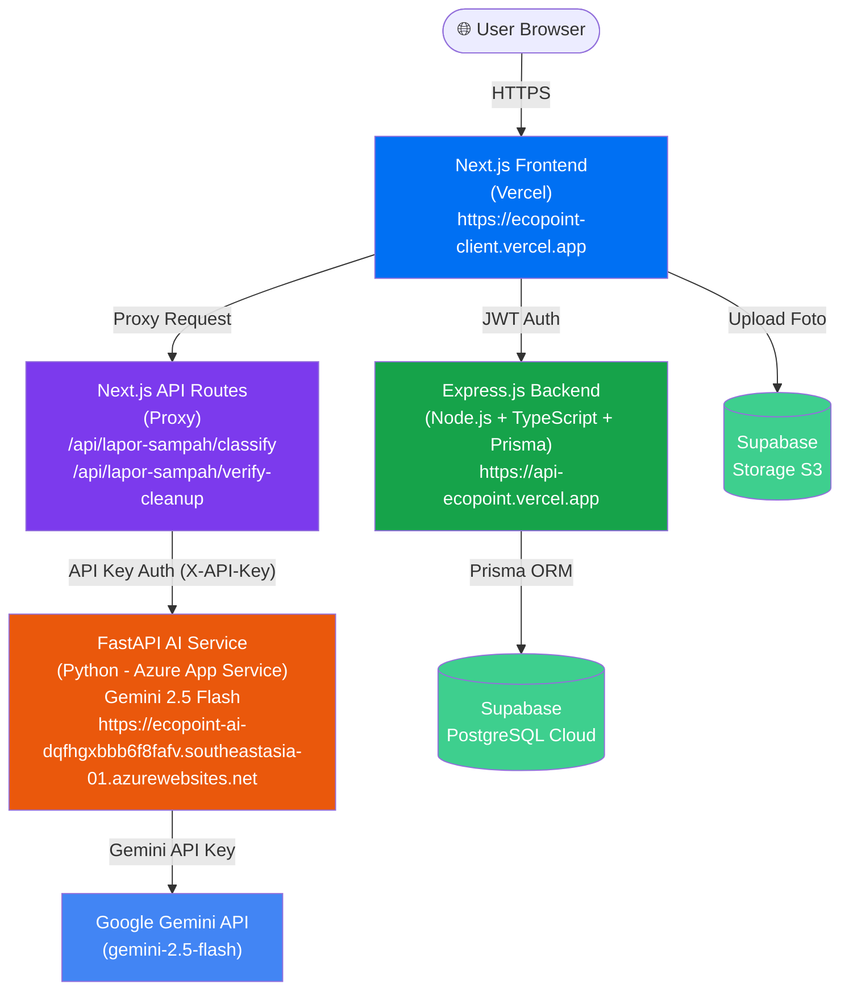

# ♻️ EcoPoint

<p align="center">
  <i>Platform manajemen sampah berbasis web yang menggabungkan Kecerdasan Buatan (AI), Cloud Computing, dan Jaringan Komputer untuk menghadirkan klasifikasi sampah cerdas dan keterlibatan pengguna berbasis reward secara real-time dalam sistem yang scalable.</i>
</p>

<p align="center">
  
  
  
  
  
  
</p>

<p align="center">
  <a href="https://ecopoint-client.vercel.app"><strong>🌐 Frontend (https://ecopoint-client.vercel.app)</strong></a> &nbsp;|&nbsp;
  <a href="https://api-ecopoint.vercel.app"><strong>⚙️ Backend API (https://api-ecopoint.vercel.app)</strong></a>
</p>
<p align="center">
  <a href="https://ecopoint-ai-dqfhgxbbb6f8fafv.southeastasia-01.azurewebsites.net"><strong>🤖 AI Service (https://ecopoint-ai-dqfhgxbbb6f8fafv.southeastasia-01.azurewebsites.net)</strong></a>
</p>

---

## 👥 Tim Pengembang — Kelompok 3 Serangkai

| Peran | Nama | NIM |
|---|---|---|
| Ketua | Fahmi Irfan Faiz | 23/520563/TK/57396 |
| Anggota | Benjamin Sigit | 23/514737/TK/56513 |
| Anggota | Reza Hanif Firmansyah | 23/522571/TK/57700 |

---

## 📋 Daftar Isi

- [Gambaran Umum](#gambaran-umum)
- [Fitur Utama](#fitur-utama)
- [Arsitektur Sistem](#arsitektur-sistem)
- [Tech Stack](#tech-stack)
- [Struktur Repositori](#struktur-repositori)
- [Skema Database](#skema-database)
- [REST API Reference](#rest-api-reference)
- [Setup & Instalasi Lokal](#setup--instalasi-lokal)
  - [Prerequisites](#prerequisites)
  - [1. Clone Repository](#1-clone-repository)
  - [2. Setup Backend](#2-setup-backend)
  - [3. Setup AI Service](#3-setup-ai-service)
  - [4. Setup Frontend](#4-setup-frontend)
  - [5. Menjalankan Semua Service](#5-menjalankan-semua-service)
- [Konfigurasi Environment Variables](#konfigurasi-environment-variables)
- [Deployment](#deployment)
- [Alur Kerja Sistem (User Flow)](#alur-kerja-sistem-user-flow)

---

## Gambaran Umum

**EcoPoint** adalah platform gamifikasi manajemen sampah yang dirancang untuk mendorong mahasiswa agar aktif melaporkan dan membersihkan sampah di lingkungan kampus. Pengguna mendapatkan poin dari setiap laporan yang diverifikasi, yang dapat ditukarkan dengan reward nyata.

Platform ini mengintegrasikan tiga lapisan teknologi:
1. **Frontend** — Antarmuka web modern berbasis Next.js
2. **Backend** — REST API menggunakan Express.js + TypeScript + Prisma ORM
3. **AI Service** — Microservice Python (FastAPI) untuk klasifikasi sampah dan verifikasi kebersihan menggunakan Google Gemini API


## Fitur Utama

### 👤 Fitur Pengguna
| Fitur | Deskripsi |
|---|---|
| **Registrasi & Login** | Autentikasi berbasis JWT dengan email, NIM, dan fakultas |
| **Dashboard Personal** | Ringkasan poin, level, badge, grafik aktivitas mingguan, dan login streak |
| **Lapor Sampah + AI** | Upload foto sampah → AI mengklasifikasikan jenis sampah + verifikasi foto sebelum-sesudah |
| **Riwayat Laporan** | Daftar semua laporan beserta status validasi |
| **Leaderboard** | Peringkat pengguna berdasarkan poin (mingguan & all-time) |
| **Daily Challenge** | Tantangan harian dengan reward poin (login, lapor sampah, dll.) |
| **Sistem Level** | Naik level berdasarkan akumulasi poin sepanjang waktu |
| **Badge / Pencapaian** | Badge otomatis diberikan saat memenuhi syarat (laporan, streak, dll.) |
| **Tukar Poin (Rewards)** | Penukaran poin dengan reward fisik/virtual yang tersedia |
| **Profil** | Pengelolaan data diri dan avatar (6 pilihan avatar default) |
| **Notifikasi** | Notifikasi real-time untuk badge, laporan disetujui, dan pengumuman admin |

### 🔐 Fitur Admin
| Fitur | Deskripsi |
|---|---|
| **Dashboard Admin** | Statistik platform: total user, laporan selesai, poin terdistribusi |
| **Validasi Laporan** | Review, setujui, atau tolak laporan sampah yang masuk |
| **Auto-Verify (Fallback)** | Laporan yang tidak direspons dalam 24 jam diverifikasi otomatis oleh AI |
| **Manajemen Reward** | CRUD reward beserta filter status aktif/nonaktif |
| **Manajemen Badge** | CRUD badge dengan pengaturan jenis syarat (poin, laporan, streak) |
| **Manajemen Challenge** | CRUD daily challenge (permanen/acak), pengaturan bonus harian |
| **Manajemen Level** | CRUD hierarki level dan syarat poin per level |
| **Manajemen User** | Lihat daftar pengguna, detail profil, dan penghapusan akun |
| **Broadcast Notifikasi** | Kirim pengumuman ke seluruh pengguna |

---

## Arsitektur Sistem



---

## Tech Stack

### Frontend (`/frontend`)
| Teknologi | Versi | Kegunaan |
|---|---|---|
| Next.js | 15 | Framework React (App Router) |
| React | 19 | UI Library |
| TypeScript | - | Type safety |
| Tailwind CSS | v4 | Styling |
| Radix UI | - | Komponen UI primitif (Dialog, Tabs, dll.) |
| Lucide React | - | Icon library |
| Recharts | - | Grafik aktivitas mingguan |
| canvas-confetti | - | Efek gamifikasi |
| Supabase JS | - | Storage upload foto |

### Backend (`/backend`)
| Teknologi | Versi | Kegunaan |
|---|---|---|
| Node.js | - | Runtime |
| Express.js | v5 | Framework REST API |
| TypeScript | - | Type safety |
| Prisma Client | v7.8.0 | ORM database |
| `@prisma/adapter-pg` | - | PostgreSQL adapter |
| `jsonwebtoken` | - | JWT authentication |
| `bcrypt` | - | Password hashing |
| `helmet` | - | HTTP security headers |
| `cors` | - | Cross-Origin Resource Sharing |
| `web-push` | - | Push notification support |

### AI Service (`/ai`)
| Teknologi | Versi | Kegunaan |
|---|---|---|
| Python | ≥3.13 | Runtime |
| FastAPI | ≥0.136.1 | Framework REST API |
| Uvicorn | ≥0.47.0 | ASGI server |
| `google-genai` SDK | ≥0.1.1 | Google Gemini API client |
| Gemini 2.5 Flash | - | Model AI multimodal |
| Pillow | ≥10.0.0 | Pemrosesan gambar |
| Pydantic | ≥2.0.0 | Validasi & schema output terstruktur |
| `python-dotenv` | - | Pengelolaan env vars |
| `python-multipart` | - | Parsing multipart/form-data |

### Infrastructure & Cloud
| Komponen | Platform | URL |
|---|---|---|
| Frontend Hosting | Vercel | [ecopoint-client.vercel.app](https://ecopoint-client.vercel.app) |
| Backend API Hosting | Vercel | [api-ecopoint.vercel.app](https://api-ecopoint.vercel.app) |
| AI Service Hosting | Azure App Service | [ecopoint-ai-...azurewebsites.net](https://ecopoint-ai-dqfhgxbbb6f8fafv.southeastasia-01.azurewebsites.net) |
| Database | Supabase (PostgreSQL) | [supabase.com](https://supabase.com) |
| File Storage | Supabase Storage (S3) | [supabase.com](https://supabase.com) |
| CI/CD | GitHub Actions (via `.github/`) | - |

---

## Struktur Repositori

```
EcoPoint/
├── frontend/                   # Next.js frontend application
│   ├── src/
│   │   ├── app/                # Next.js App Router pages
│   │   │   ├── page.tsx        # Landing page
│   │   │   ├── login/          # Halaman login
│   │   │   ├── register/       # Halaman registrasi
│   │   │   ├── dashboard/      # Dashboard pengguna
│   │   │   ├── lapor-sampah/   # Halaman lapor sampah (+ tab riwayat)
│   │   │   ├── leaderboard/    # Halaman leaderboard
│   │   │   ├── tukar-poin/     # Halaman penukaran reward
│   │   │   ├── profile/        # Halaman profil pengguna
│   │   │   ├── admin/          # Panel admin (layout terpisah)
│   │   │   │   ├── page.tsx    # Dashboard admin
│   │   │   │   ├── validasi/   # Validasi laporan sampah
│   │   │   │   ├── rewards/    # Manajemen reward
│   │   │   │   ├── badges/     # Manajemen badge
│   │   │   │   ├── challenges/ # Manajemen daily challenge
│   │   │   │   ├── levels/     # Manajemen level
│   │   │   │   ├── users/      # Manajemen pengguna
│   │   │   │   └── notifications/ # Broadcast notifikasi
│   │   │   └── api/            # Next.js proxy API routes
│   │   │       └── lapor-sampah/
│   │   │           ├── classify/       # Proxy ke AI Service /classify
│   │   │           └── verify-cleanup/ # Proxy ke AI Service /verify-cleanup
│   │   ├── components/         # Komponen UI yang dapat digunakan ulang
│   │   │   ├── laporsampah/    # Komponen halaman lapor sampah
│   │   │   │   ├── WasteUpload.tsx  # Upload & klasifikasi AI
│   │   │   │   └── History.tsx      # Riwayat laporan
│   │   │   ├── Navbar.tsx      # Navigasi utama
│   │   │   └── ui/             # Komponen primitif (Button, Dialog, dll.)
│   │   └── lib/
│   │       └── auth.ts         # Helper autentikasi (token, API base URL)
│   ├── .env                    # Environment variables frontend
│   └── package.json
│
├── backend/                    # Express.js REST API
│   ├── src/
│   │   ├── app.ts              # Konfigurasi Express + middleware + routing
│   │   ├── server.ts           # Entry point server (port listener)
│   │   ├── controllers/        # Logika bisnis per domain
│   │   │   ├── authController.ts
│   │   │   ├── dashboardController.ts
│   │   │   ├── wasteReportController.ts
│   │   │   ├── rewardsController.ts
│   │   │   ├── badgeController.ts
│   │   │   ├── dailyChallengeController.ts
│   │   │   ├── levelController.ts
│   │   │   ├── leaderboardController.ts
│   │   │   ├── notificationController.ts
│   │   │   └── usersController.ts
│   │   ├── routes/             # Definisi route per domain
│   │   │   ├── authRoute.ts
│   │   │   ├── dashboardRoute.ts
│   │   │   ├── wasteReportRoute.ts
│   │   │   ├── rewardsRoute.ts
│   │   │   ├── rewardAdminRoute.ts
│   │   │   ├── badgeRoute.ts
│   │   │   ├── dailyChallengeRoute.ts
│   │   │   ├── levelRoute.ts
│   │   │   ├── leaderboardRoute.ts
│   │   │   ├── notificationRoute.ts
│   │   │   └── usersRoute.ts
│   │   ├── services/           # Background services
│   │   │   ├── achievementService.ts  # Evaluasi & pemberian badge otomatis
│   │   │   ├── autoResolveService.ts  # Auto-validasi laporan setelah 24 jam
│   │   │   └── notificationService.ts # Helper membuat notifikasi
│   │   ├── middleware/
│   │   │   └── auth.ts         # JWT auth middleware + admin middleware
│   │   └── lib/
│   │       ├── prisma.ts       # Prisma client instance
│   │       └── dateUtils.ts    # Utilitas tanggal WIB (UTC+7)
│   ├── prisma/
│   │   └── schema.prisma       # Skema database Prisma
│   ├── .env                    # Environment variables backend
│   └── package.json
│
├── ai/                         # Python FastAPI AI microservice
│   ├── main.py                 # FastAPI app + endpoint routing
│   ├── classify.py             # Logika klasifikasi & verifikasi Gemini
│   ├── requirements.txt        # Python dependencies
│   ├── .env                    # Environment variables AI service
│   └── README.md               # Dokumentasi AI service
│
├── docs/                       # Dokumentasi tambahan proyek
├── .github/                    # CI/CD workflows GitHub Actions
└── README.md                   # Dokumentasi utama ini
```

---

## Skema Database

Database menggunakan **PostgreSQL** (hosted di Supabase) yang dikelola melalui **Prisma ORM**.

### Model Utama

```prisma
model users {
  user_id              String    @id @default(uuid())
  nama                 String
  nim                  String    @unique
  email                String    @unique
  password             String
  role                 String    @default("mahasiswa")  // "mahasiswa" | "admin"
  fakultas             String
  total_poin           BigInt    @default(0)
  profile_pic          BigInt    @default(0)   // 0-5 (indeks avatar)
  is_edited            Boolean   @default(false)
  current_login_streak Int       @default(0)
  last_login_date      DateTime? @db.Date
  created_at           DateTime  @default(now())
  // Relations...
}

model waste_reports {
  report_id       BigInt    @id @default(autoincrement())
  user_id         String    @db.Uuid
  foto_url        String    // JSON: { before, after, classify_result, verify_result }
  deskripsi       String
  lokasi          String
  kategori_user   String
  kategori_ai     String
  status_validasi String    // "pending" | "approved" | "rejected" | "auto_approved" | "auto_rejected"
  poin_didapat    BigInt    @default(0)
  created_at      DateTime  @default(now())
}

model rewards {
  reward_id       String   @id @default(uuid())
  nama_reward     String
  deskripsi       String
  poin_dibutuhkan BigInt
  stok            Int
  kategori        String
  is_active       Boolean  @default(true)
}

model badges {
  badges_id    String  @id @default(uuid())
  nama_badge   String  @unique
  deskripsi    String
  jenis_syarat String  // "TOTAL_POIN" | "TOTAL_LAPORAN" | "LOGIN_STREAK" | "CHALLENGE_SELESAI"
  nilai_syarat BigInt  @default(0)
}

model daily_challenges {
  challenge_id   String  @id @default(uuid())
  judul          String
  deskripsi      String
  challenge_type String  // "waste_report" | "login_streak" | dll.
  target_count   BigInt
  poin_reward    BigInt
  is_active      Boolean @default(true)
  is_permanent   Boolean @default(false)
}

model levels {
  level_id     String @id @default(uuid())
  level_number Int    @unique
  nama_level   String
  syarat_poin  BigInt
}

model notifications {
  notifications_id String   @id @default(uuid())
  user_id          String   @db.Uuid
  pesan            String
  is_read          Boolean  @default(false)
  created_at       DateTime @default(now())
}
```

---

## REST API Reference

Base URL Lokal: `http://localhost:4000/api`
Base URL Produksi: dikonfigurasi melalui `NEXT_PUBLIC_API_BASE_URL`

### 🔐 Authentication — `/api/auth`

| Method | Endpoint | Auth | Deskripsi |
|--------|----------|------|-----------|
| `POST` | `/auth/register` | ❌ | Registrasi akun baru |
| `POST` | `/auth/login` | ❌ | Login, mengembalikan JWT token |
| `GET`  | `/auth/me` | ✅ User | Ambil profil pengguna sendiri |
| `PUT`  | `/auth/profile` | ✅ User | Update profil (nama, NIM, fakultas hanya sekali; avatar bebas) |

**Body `POST /auth/register`:**
```json
{
  "nama": "John Doe",
  "nim": "23/123456/TK/12345",
  "email": "john@example.com",
  "password": "password123",
  "fakultas": "Teknik"
}
```

**Response `POST /auth/login`:**
```json
{
  "message": "Login berhasil",
  "token": "<JWT_TOKEN>",
  "user": { "user_id": "...", "nama": "...", "role": "mahasiswa", ... }
}
```

---

### 🏠 Dashboard — `/api/dashboard`

| Method | Endpoint | Auth | Deskripsi |
|--------|----------|------|-----------|
| `GET` | `/dashboard` | ✅ User | Semua data dashboard dalam satu request (BFF pattern) |

**Response includes:** profil user, statistik (poin, laporan, badge), grafik aktivitas mingguan, level saat ini & berikutnya, login streak, badge terbaru, notifikasi terbaru, dan stats admin (jika role admin).

---

### 🗑️ Laporan Sampah — `/api/admin/waste-reports`

| Method | Endpoint | Auth | Deskripsi |
|--------|----------|------|-----------|
| `GET` | `/admin/waste-reports/my-reports` | ✅ User | Riwayat laporan milik sendiri (dengan lazy auto-resolve) |
| `GET` | `/admin/waste-reports` | ✅ Admin | Semua laporan (bisa filter by status) |
| `GET` | `/admin/waste-reports/:id` | ✅ Admin | Detail satu laporan |
| `POST` | `/admin/waste-reports/:id/approve` | ✅ Admin | Setujui laporan + beri poin |
| `POST` | `/admin/waste-reports/:id/reject` | ✅ Admin | Tolak laporan |
| `POST` | `/admin/waste-reports/process-expired` | ✅ Admin | Batch proses laporan expired (fallback manual) |

> **Note:** Laporan di-create melalui Next.js API Routes (proxy) yang memanggil AI Service terlebih dahulu, bukan langsung ke endpoint ini.

---

### 🏆 Leaderboard — `/api/leaderboard`

| Method | Endpoint | Auth | Deskripsi |
|--------|----------|------|-----------|
| `GET` | `/leaderboard?period=weekly` | ❌ | Leaderboard mingguan |
| `GET` | `/leaderboard?period=alltime` | ❌ | Leaderboard all-time |

---

### 🎁 Rewards (User) — `/api/rewards`

| Method | Endpoint | Auth | Deskripsi |
|--------|----------|------|-----------|
| `GET` | `/rewards` | ❌ | Daftar reward aktif yang tersedia |
| `POST` | `/rewards/redeem` | ✅ User | Tukar poin dengan reward |
| `GET` | `/rewards/history` | ✅ User | Riwayat penukaran reward |
| `PATCH` | `/rewards/use` | ✅ User | Tandai reward sebagai "sudah digunakan" |

**Body `POST /rewards/redeem`:**
```json
{ "reward_id": "<uuid>" }
```

---

### 🎁 Rewards (Admin) — `/api/admin/rewards`

| Method | Endpoint | Auth | Deskripsi |
|--------|----------|------|-----------|
| `GET` | `/admin/rewards` | ✅ Admin | Semua reward (aktif & nonaktif) |
| `GET` | `/admin/rewards/:id` | ✅ Admin | Detail reward + riwayat redemption |
| `POST` | `/admin/rewards` | ✅ Admin | Buat reward baru |
| `PUT` | `/admin/rewards/:id` | ✅ Admin | Update reward |
| `DELETE` | `/admin/rewards/:id` | ✅ Admin | Hapus reward |

---

### 🎖️ Badges — `/api/badges`

| Method | Endpoint | Auth | Deskripsi |
|--------|----------|------|-----------|
| `GET` | `/badges` | ❌ | Daftar badge & badge yang sudah diraih user |
| `GET` | `/badges/admin/all` | ✅ Admin | Semua badge |
| `POST` | `/badges/admin` | ✅ Admin | Buat badge baru |
| `PUT` | `/badges/admin/:id` | ✅ Admin | Update badge |
| `DELETE` | `/badges/admin/:id` | ✅ Admin | Hapus badge |

**Jenis syarat badge (`jenis_syarat`):**
- `TOTAL_POIN` — Total poin yang dimiliki
- `TOTAL_LAPORAN` — Total laporan yang disetujui
- `LOGIN_STREAK` — Streak login harian berturut-turut
- `CHALLENGE_SELESAI` — Total challenge harian yang diselesaikan

---

### 🎯 Daily Challenge — `/api/daily-challenges`

| Method | Endpoint | Auth | Deskripsi |
|--------|----------|------|-----------|
| `GET` | `/daily-challenges/today` | ✅ User | Challenge hari ini beserta progress user |
| `POST` | `/daily-challenges/track-action` | ✅ User | Rekam aksi untuk update progress otomatis |
| `POST` | `/daily-challenges/progress` | ✅ User | Update progress manual |
| `POST` | `/daily-challenges/claim` | ✅ User | Klaim poin challenge yang sudah selesai |
| `GET` | `/daily-challenges/admin/all` | ✅ Admin | Semua template challenge |
| `GET` | `/daily-challenges/admin/today` | ✅ Admin | Challenge yang aktif hari ini |
| `GET` | `/daily-challenges/admin/bonus` | ✅ Admin | Setting bonus harian |
| `PUT` | `/daily-challenges/admin/bonus` | ✅ Admin | Update setting bonus harian |
| `POST` | `/daily-challenges/admin` | ✅ Admin | Buat template challenge baru |
| `PUT` | `/daily-challenges/admin/:id` | ✅ Admin | Update challenge |
| `DELETE` | `/daily-challenges/admin/:id` | ✅ Admin | Hapus challenge |
| `DELETE` | `/daily-challenges/admin/reset-today` | ✅ Admin | Reset challenge hari ini |

---

### 📊 Levels — `/api/levels`

| Method | Endpoint | Auth | Deskripsi |
|--------|----------|------|-----------|
| `GET` | `/levels` | ❌ | Daftar semua level |
| `POST` | `/levels/admin` | ✅ Admin | Buat level baru |
| `PUT` | `/levels/admin/:id` | ✅ Admin | Update level |
| `DELETE` | `/levels/admin/:id` | ✅ Admin | Hapus level |

---

### 🔔 Notifikasi — `/api/notifications`

| Method | Endpoint | Auth | Deskripsi |
|--------|----------|------|-----------|
| `GET` | `/notifications` | ✅ User | Daftar notifikasi milik user |
| `PATCH` | `/notifications/:id/read` | ✅ User | Tandai 1 notifikasi sebagai dibaca |
| `PATCH` | `/notifications/read-all` | ✅ User | Tandai semua notifikasi sebagai dibaca |
| `GET` | `/admin/notifications` | ✅ Admin | Daftar broadcast yang pernah dikirim |
| `POST` | `/admin/notifications` | ✅ Admin | Kirim broadcast ke semua user |
| `DELETE` | `/admin/notifications/:id` | ✅ Admin | Hapus broadcast |

---

### 👥 Users (Admin) — `/api/admin/users`

| Method | Endpoint | Auth | Deskripsi |
|--------|----------|------|-----------|
| `GET` | `/admin/users` | ✅ Admin | Daftar semua user |
| `GET` | `/admin/users/:id` | ✅ Admin | Detail satu user |
| `PUT` | `/admin/users/:id` | ✅ Admin | Update data user |
| `DELETE` | `/admin/users/:id` | ✅ Admin | Hapus user |

---

### 🤖 AI Service Endpoints

Base URL: `http://localhost:8000` (atau URL Azure App Service jika deployed)

> Semua endpoint wajib menyertakan header `X-API-Key: <AI_SERVICE_API_KEY>`

| Method | Endpoint | Deskripsi |
|--------|----------|-----------|
| `GET` | `/` | Health check AI service |
| `POST` | `/classify` | Klasifikasi sampah dari gambar dan/atau deskripsi teks |
| `POST` | `/verify-cleanup` | Verifikasi kebersihan dari foto sebelum & sesudah |

**`POST /classify` — Body (multipart/form-data):**
```
file: <image file>           (opsional)
description: "Botol plastik" (opsional)
```

**Response `/classify`:**
```json
{
  "ok": true,
  "result": {
    "category": "anorganik",
    "confidence": 0.95,
    "explanation": "Botol plastik tergolong sampah anorganik..."
  }
}
```

**`POST /verify-cleanup` — Body (multipart/form-data):**
```
before_image: <image file>  (wajib)
after_image: <image file>   (wajib)
location: "Parkir Timur"    (opsional)
```

**Response `/verify-cleanup`:**
```json
{
  "ok": true,
  "result": {
    "status": "cleaned",           // "cleaned" | "not_cleaned" | "partially_cleaned" | "unrelated_images"
    "confidence": 0.98,
    "before_description": "Tumpukan sampah plastik...",
    "after_description": "Area bersih...",
    "explanation": "Gambar setelah menunjukkan area yang sama namun bersih.",
    "reward_eligible": true
  }
}
```

---

## Setup & Instalasi Lokal

### Prerequisites

Pastikan sudah terinstall:
- **Node.js** v18+ dan **npm** v9+
- **Python** v3.13+
- **Git**
- Akun **Supabase** (untuk database PostgreSQL)
- **Google AI Studio API Key** (untuk Gemini API)

### 1. Clone Repository

```bash
git clone https://github.com/<username>/EcoPoint.git
cd EcoPoint
```

### 2. Setup Backend

```bash
cd backend

# Install dependencies
npm install

# Buat file .env (lihat bagian Environment Variables)
cp .env.example .env
# Edit .env sesuai konfigurasimu

# Generate Prisma client
npx prisma generate

# (Opsional) Push skema ke database
npx prisma db push

# Jalankan dalam mode development
npm run dev
```

Backend akan berjalan di `http://localhost:4000`

### 3. Setup AI Service

```bash
cd ai

# Buat virtual environment Python
python -m venv .venv

# Aktivasi virtual environment
# Windows:
.venv\Scripts\activate
# Linux/Mac:
source .venv/bin/activate

# Install dependencies
pip install -r requirements.txt

# Buat file .env
# Edit .env sesuai konfigurasimu

# Jalankan AI service
uvicorn main:app --reload --host 0.0.0.0 --port 8000
```

AI Service akan berjalan di `http://localhost:8000`

### 4. Setup Frontend

```bash
cd frontend

# Install dependencies
npm install

# Buat file .env
# Edit .env sesuai konfigurasimu

# Jalankan dalam mode development
npm run dev
```

Frontend akan berjalan di `http://localhost:3000`

### 5. Menjalankan Semua Service

Buka **3 terminal terpisah** dan jalankan:

```bash
# Terminal 1 — Backend
cd backend && npm run dev

# Terminal 2 — AI Service
cd ai && .venv/Scripts/activate && uvicorn main:app --reload --port 8000

# Terminal 3 — Frontend
cd frontend && npm run dev
```

---

## Konfigurasi Environment Variables

### Backend (`backend/.env`)

```env
# Database (Supabase PostgreSQL)
DATABASE_URL="postgresql://postgres:<password>@<host>:5432/postgres"

# JWT
JWT_SECRET="your_super_secret_jwt_key_here"

# AI Service
AI_SERVICE_URL="http://localhost:8000"       # atau URL Azure App Service
AI_SERVICE_API_KEY="your_ai_service_api_key"

# Port (opsional, default 4000)
PORT=4000
```

### AI Service (`ai/.env`)

```env
# Google Gemini API Key (salah satu nama ini)
GEMINI_API_KEY="your_google_gemini_api_key"
# atau
GOOGLE_API_KEY="your_google_gemini_api_key"

# API Key untuk mengamankan endpoint FastAPI
AI_SERVICE_API_KEY="your_ai_service_api_key"
```

### Frontend (`frontend/.env`)

```env
# URL backend API (TANPA trailing slash)
NEXT_PUBLIC_API_BASE_URL="http://localhost:4000/api"

# URL AI Service (untuk proxy route di Next.js)
AI_SERVICE_URL="http://localhost:8000"
AI_SERVICE_API_KEY="your_ai_service_api_key"

# Supabase (untuk upload foto)
NEXT_PUBLIC_SUPABASE_URL="https://xxxx.supabase.co"
NEXT_PUBLIC_SUPABASE_ANON_KEY="your_supabase_anon_key"
```

---

## Deployment

| Service | Platform | URL |
|---|---|---|
| Frontend | Vercel | `https://ecopoint-client.vercel.app` |
| Backend | *(sesuai konfigurasi)* | dikonfigurasi via env |
| AI Service | Azure App Service | dikonfigurasi via `AI_SERVICE_URL` |
| Database | Supabase Cloud | dikonfigurasi via `DATABASE_URL` |

### Deploy Frontend ke Vercel

1. Push kode ke GitHub
2. Import project di [vercel.com](https://vercel.com)
3. Set Environment Variables di dashboard Vercel (sama seperti `frontend/.env`)
4. Deploy otomatis setiap push ke `main`

### Deploy AI Service ke Azure App Service

1. Pastikan `requirements.txt` sudah lengkap
2. Atur **Startup Command**: `uvicorn main:app --host 0.0.0.0 --port 8000`
3. Set Application Settings (env vars) di Azure Portal:
   - `GEMINI_API_KEY`
   - `AI_SERVICE_API_KEY`

---

## Alur Kerja Sistem (User Flow)

### Alur Lapor Sampah dengan AI

```
User upload foto "SEBELUM" (area kotor)
          │
          ▼
Next.js proxy → POST /classify ke AI Service
          │
          ▼
AI Service (Gemini 2.5 Flash) menganalisis gambar
  → Mengembalikan: kategori, confidence, penjelasan
          │
          ▼
User upload foto "SESUDAH" (area bersih)
          │
          ▼
Next.js proxy → POST /verify-cleanup ke AI Service
          │
          ▼
AI Service membandingkan foto before vs after
  → Mengembalikan: status, confidence, reward_eligible
          │
          ▼
User isi deskripsi & lokasi → Submit laporan
          │
          ▼
Data disimpan ke waste_reports (status: "pending")
          │
          ▼
Admin mereview laporan
     ├── Setujui → status: "approved", poin ditambahkan, badge dievaluasi
     └── Tolak   → status: "rejected"

Jika admin tidak merespons dalam 24 jam:
     ├── AI verify_result.reward_eligible = true  → status: "auto_approved", poin ditambahkan
     └── AI verify_result.reward_eligible = false → status: "auto_rejected"
```

### Alur Gamifikasi

```
Laporan disetujui
      │
      ▼
Poin ditambahkan ke user.total_poin
      │
      ├── achievementService.evaluateUserAchievements()
      │       → Cek semua badge yang belum diraih
      │       → Berikan badge jika syarat terpenuhi
      │       → Kirim notifikasi badge baru
      │
      └── Level dihitung dari lifetime_poin
              (total_poin + poin yang sudah ditukar)
```

---

## 📄 Lisensi

Proyek ini dikembangkan sebagai **Tugas Besar Senior Project** Departemen Teknik Elektro dan Teknologi Informasi (DTETI), Fakultas Teknik, Universitas Gadjah Mada.

© 2025 Kelompok 3 Serangkai — EcoPoint Team
