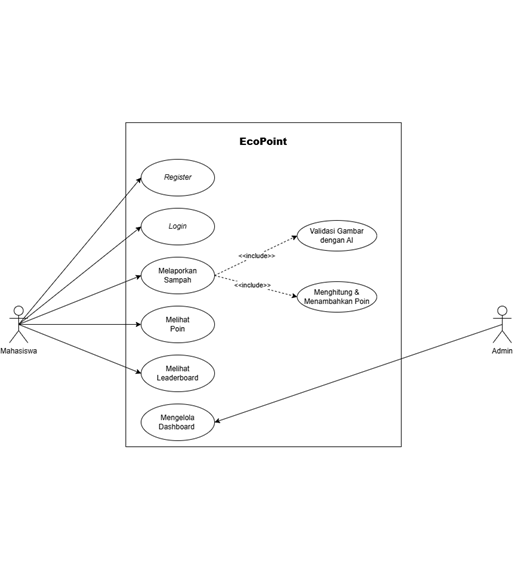
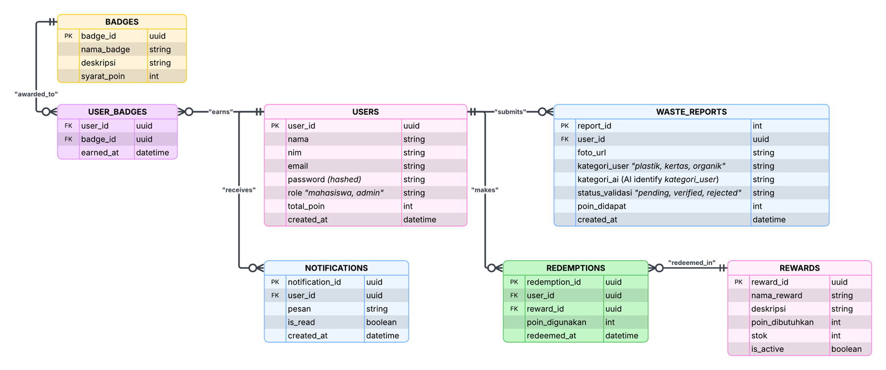
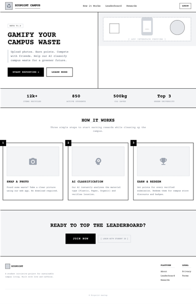
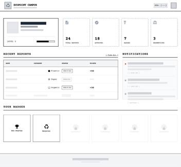
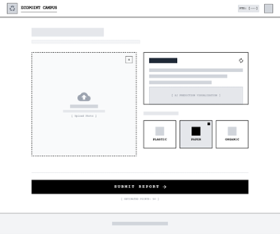
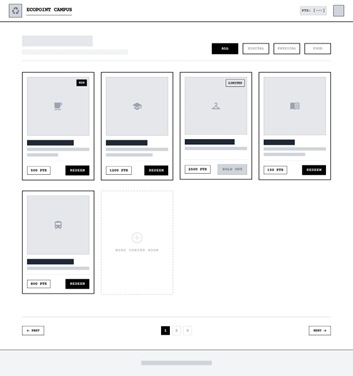
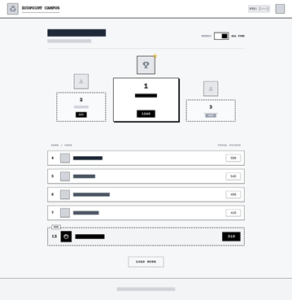
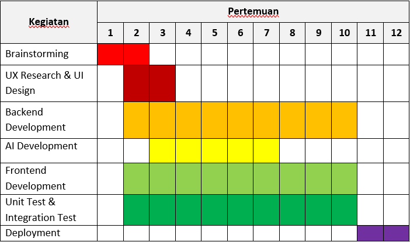

# Modul 2

## Metodologi SDLC

### Metodologi yang Digunakan

**Scrumban**

### Alasan pemilihan metodologi

Metodologi Scrumban dipilih karena menggabungkan pendekatan iteratif dan inkremental melalui sprint dari Scrum dengan fleksibilitas alur kerja yang tervisualisasi dari Kanban. Kombinasi ini sangat sesuai untuk mengelola dan mengembangkan produk proyek senior teknologi informasi yang kompleks dalam tim kecil seperti tim kami.

**Keunggulan Scrumban untuk Proyek EcoPoint:**

- **Fleksibilitas Tinggi**: Memungkinkan adaptasi cepat terhadap perubahan requirement tanpa mengorbankan struktur kerja
- **Visualisasi Kerja**: Kanban board memberikan transparansi penuh terhadap progress dan bottleneck
- **Iterasi Terstruktur**: Sprint dari Scrum memastikan delivery yang konsisten dan terukur
- **Cocok untuk Tim Kecil**: Overhead yang minimal dengan produktivitas maksimal
- **Continuous Improvement**: Retrospective dan WIP limits mendorong peningkatan berkelanjutan

---

## Perancangan Tahap 1-3 SDLC

### a. Tujuan dari produk

Secara umum, tujuan dari produk EcoPoint adalah untuk **meningkatkan partisipasi masyarakat khususnya mahasiswa dalam pengelolaan sampah yang terukur dan berkelanjutan** dengan detail sebagai berikut:

#### Tujuan Spesifik:

1. **Meningkatkan Partisipasi Pengguna**  
   Meningkatkan partisipasi pengguna dalam pemilahan dan pelaporan sampah melalui sistem gamifikasi yang interaktif dan transparan

2. **Sistem Pelaporan Real-time**  
   Menyediakan sistem pelaporan dan monitoring berbasis data secara real-time untuk mendukung pengambilan keputusan yang lebih efektif

3. **Implementasi Teknologi Modern**  
   Mengimplementasikan teknologi AI dan Komputasi Awan guna meningkatkan akurasi validasi data serta memastikan sistem yang skalabel dan terintegrasi

4. **Mendukung Keberlanjutan Lingkungan**  
   Mendukung upaya keberlanjutan lingkungan yang selaras dengan Sustainable Development Goals (SDGs), khususnya SDG 11 (Sustainable Cities and Communities), SDG 12 (Responsible Consumption and Production), dan SDG 13 (Climate Action)

---

### b.	Pengguna potensial dari produk dan kebutuhan para pengguna tersebut 

#### Primary Users (Pengguna Utama)

**1. Mahasiswa (Student Users)**

- **Profil**: Mahasiswa aktif yang peduli lingkungan dan tertarik dengan sistem reward
- **Kebutuhan**:
  - Antarmuka yang user-friendly dan intuitif
  - Proses upload foto sampah yang mudah dan cepat
  - Sistem poin yang transparan dan real-time
  - Gamifikasi yang engaging (leaderboard, badges, achievements)
  - Notifikasi status validasi sampah
  - Akses ke redemption shop untuk menukar poin
  - Tracking history kontribusi dan progress

**2. Administrator (Admin Users)**

- **Profil**: Pengelola sistem dan validator data sampah
- **Kebutuhan**:
  - Dashboard komprehensif untuk monitoring aktivitas
  - Tools validasi sampah dengan bantuan AI
  - Sistem manajemen user dan laporan
  - Analytics dan reporting tools
  - Pengaturan reward dan redemption items
  - Moderasi dan quality control system

#### Secondary Users (Pengguna Sekunder)

**3. Institusi Pendidikan**

- **Profil**: Universitas/kampus yang ingin mengimplementasikan program sustainability
- **Kebutuhan**:
  - Laporan statistik partisipasi mahasiswa
  - Data analytics untuk program lingkungan
  - Integration dengan sistem kampus existing
  - Customizable reward system

**4. Stakeholder Lingkungan**

- **Profil**: NGO, pemerintah daerah, atau organisasi lingkungan
- **Kebutuhan**:
  - Access ke aggregated data pengelolaan sampah
  - Insight untuk policy making
  - Monitoring impact lingkungan

---

### c. Use case diagram

Diagram berikut menggambarkan interaksi antara aktor (Mahasiswa dan Admin) dengan sistem EcoPoint:

**Penjelasan Use Case:**

- **Mahasiswa** dapat melakukan registrasi, login, melaporkan sampah, melihat poin, melihat leaderboard, dan mengelola dashboard pribadi
- **Admin** memiliki akses untuk validasi gambar dengan AI, menghitung & menambahkan poin, melihat poin, dan mengelola dashboard administratif
- Sistem mencakup fitur-fitur utama sesuai dengan functional requirements yang telah ditetapkan

---

### d. Functional requirements untuk use case yang telah dirancang

Berikut adalah functional requirements untuk setiap use case yang telah dirancang:

| FR                                | Deskripsi                                                                                                           |
| --------------------------------- | ------------------------------------------------------------------------------------------------------------------- |
| **Register**                      | Sistem memungkinkan mahasiswa untuk membuat akun baru dengan memasukkan _email_ dan _password_ yang valid.          |
| **Login**                         | Sistem memungkinkan mahasiswa untuk masuk ke dalam sistem menggunakan kredensial yang telah terdaftar.              |
| **Melaporkan Sampah**             | Sistem memungkinkan mahasiswa yang telah login untuk mengunggah foto sampah dan mengirimkan laporan.                |
| **Validasi Gambar dengan AI**     | Sistem secara otomatis menganalisis foto yang diunggah untuk mengklasifikasikan jenis sampah dengan menggunakan AI. |
| **Menghitung & Menambahkan Poin** | Sistem menghitung poin berdasarkan hasil klasifikasi dan menambahkan poin tersebut ke akun mahasiswa.               |
| **Melihat Poin**                  | Sistem memungkinkan mahasiswa untuk melihat total poin yang dimiliki.                                               |
| **Melihat Leaderboard**           | Sistem menampilkan peringkat mahasiswa berdasarkan total poin tertinggi.                                            |
| **Mengelola Dashboard**           | Sistem memungkinkan admin untuk melihat dan mengelola daftar laporan sampah beserta detailnya.                      |

**Catatan**: Functional requirements di atas merupakan high-level requirements. Detail spesifikasi teknis dan acceptance criteria akan didokumentasikan dalam product backlog.

---

### e. Entity relationship diagram

ERD berikut menggambarkan struktur database dan relasi antar entitas dalam sistem EcoPoint:

**Entitas Utama:**

- **User**: Menyimpan informasi pengguna (mahasiswa dan admin)
- **Submission/Report**: Menyimpan data laporan sampah yang diupload
- **Points**: Mencatat transaksi dan akumulasi poin pengguna
- **Category**: Klasifikasi jenis sampah
- **Reward/Redemption**: Item yang dapat ditukar dengan poin
- **Leaderboard**: Aggregated data untuk ranking pengguna

**Relasi:**

- One-to-Many antara User dan Submission
- Many-to-One antara Submission dan Category
- One-to-Many antara User dan Points
- Many-to-Many antara User dan Reward (melalui Redemption table)

---

### f. Low-fidelity Wireframe

Berikut adalah wireframe untuk fitur-fitur utama aplikasi EcoPoint:

#### 1. Dashboard Page

Halaman utama yang menampilkan overview aktivitas, poin, dan statistik pengguna.

---

#### 2. Profile and Review Page

Halaman untuk mengelola profil pengguna dan melihat review/history kontribusi.

---

#### 3. Upload Page

Interface untuk mengunggah foto sampah dan mengirimkan laporan.

---

#### 4. Redemption Shop Page

Marketplace untuk menukar poin dengan reward yang tersedia.

---

#### 5. Leaderboard Page

Leaderboard untuk menampilkan urutan pengguna berdasarkan poin yang didapat.

---

### 2.7 Gantt Chart Pengerjaan Proyek

Berikut adalah timeline pengerjaan proyek EcoPoint dalam kurun waktu 1 semester:

**Fase Pengembangan:**

1. **Planning & Analysis** (Minggu 1-2)
   - Requirement gathering
   - Feasibility study
   - Technology stack selection

2. **Design** (Minggu 3-4)
   - System architecture design
   - Database design
   - UI/UX design

3. **Development** (Minggu 5-12)
   - Backend development
   - Frontend development
   - AI model training & integration
   - Cloud infrastructure setup

4. **Testing** (Minggu 13-14)
   - Unit testing
   - Integration testing
   - User acceptance testing

5. **Deployment & Handover** (Minggu 15-16)
   - Production deployment
   - Documentation
   - Presentation & demo

---

## 3. Kesimpulan

Perancangan EcoPoint menggunakan metodologi Scrumban yang memadukan struktur Scrum dengan fleksibilitas Kanban, sangat sesuai untuk tim kecil dengan requirement yang dinamis. Dengan tujuan meningkatkan partisipasi mahasiswa dalam pengelolaan sampah melalui gamifikasi, sistem ini dirancang dengan mempertimbangkan kebutuhan pengguna utama (mahasiswa dan admin) serta didukung oleh arsitektur sistem yang skalabel dan terintegrasi dengan teknologi AI dan cloud computing.

Tahapan SDLC yang telah direncanakan mencakup requirement analysis, system design, dan development planning yang matang, siap untuk diimplementasikan dalam kurun waktu 1 semester sesuai Gantt Chart yang telah disusun.

---

[← Kembali ke halaman utama](index.md)
